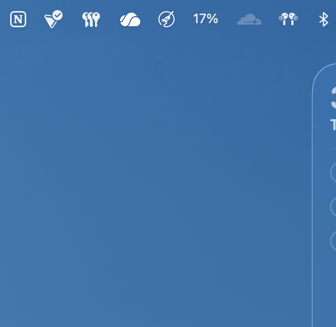
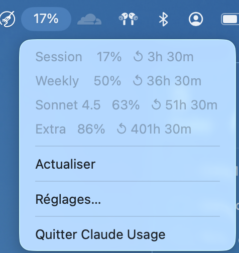
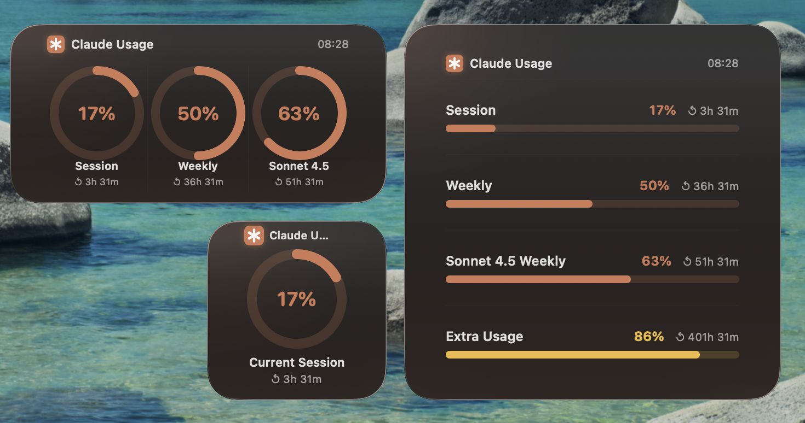
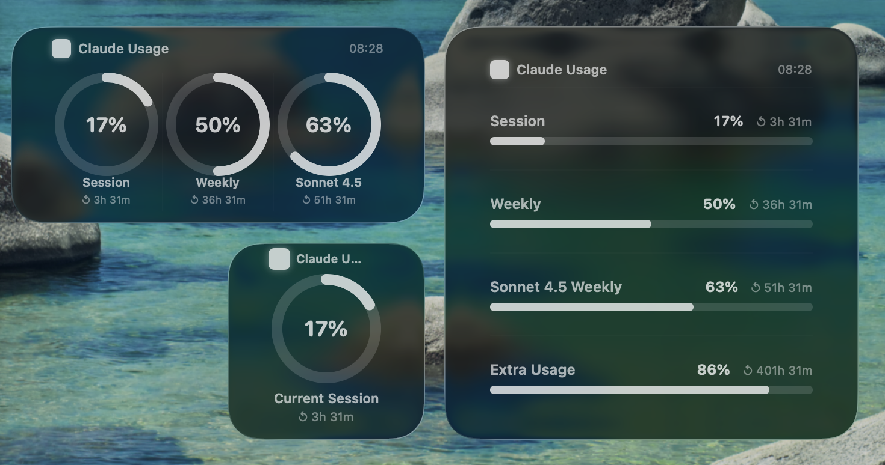
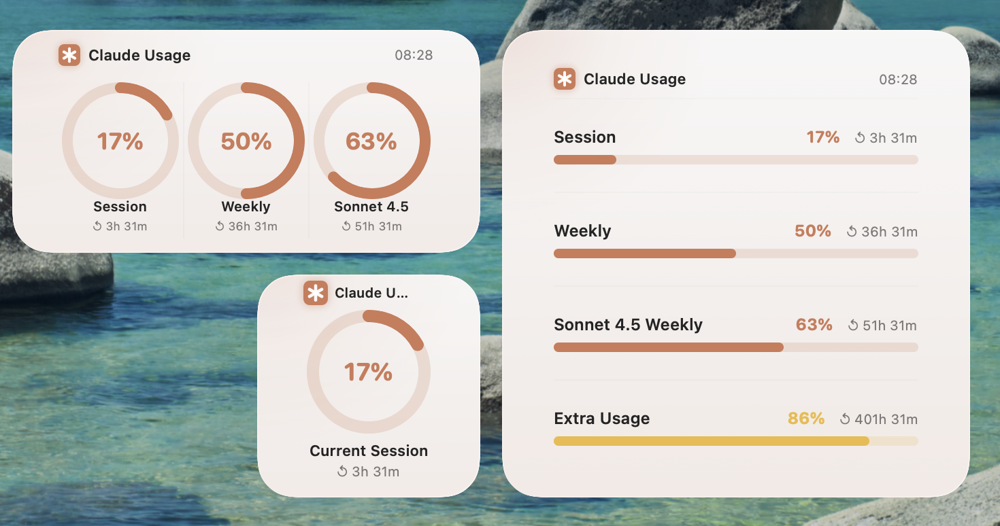
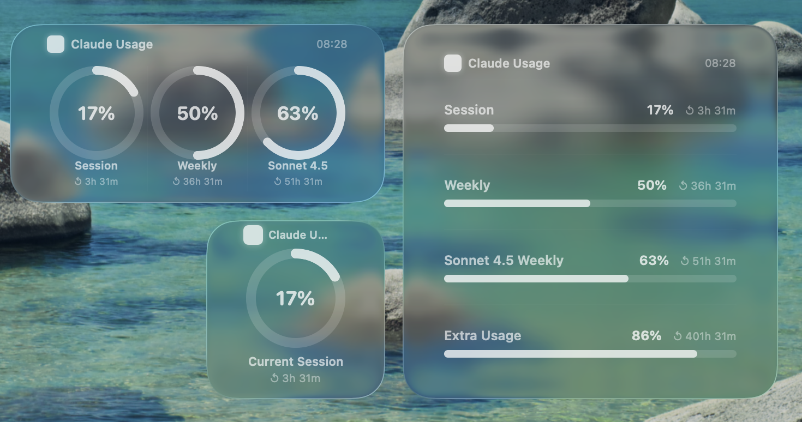

# Claude Usage Widget

A native macOS menu bar app + desktop widget that shows your Anthropic Claude usage in real time — session %, weekly %, and Sonnet 4.5 weekly %.

    

---

## Screenshots

### Menu bar

 

### Desktop widget — Dark mode

| Focused | Background (another window active) |
|---------|-----------------------------------|
|  |  |

### Desktop widget — Light mode

| Focused | Background (another window active) |
|---------|-----------------------------------|
|  |  |

---

## What it shows

| Metric | What it measures |
|--------|-----------------|
| **Session** | Rolling 5-hour usage window |
| **Weekly** | Rolling 7-day usage window |
| **Sonnet 4.5** | Sonnet-specific 7-day window (when applicable) |
| **Extra usage** | Pay-as-you-go credits (when enabled), resets monthly |

- Menu bar icon displays current session % at a glance — **color-coded** (green / orange / red)
- Desktop widget in Small / Medium / Large with Liquid Glass background, **tap to open app**
- **Threshold notifications** when usage crosses 80% or 90% (configurable)
- **Usage history** — 7-day line chart accessible from the menu bar
- **Configurable refresh interval** (1 / 2 / 5 / 10 min) in Settings
- Refreshes every **5 minutes** by default

---

## Authentication & cost

| Mode | How it works | Cost |
|------|-------------|------|
| **OAuth** (default) | Reads Claude CLI's token from the macOS Keychain, calls `GET /api/oauth/usage` — a read-only monitoring endpoint | **Free** — no tokens generated |
| **API key** (fallback) | Sends one minimal Haiku request (1 output token) to read rate-limit response headers | ~$0.0015/day |

If you have Claude Code installed and are logged in, the app uses OAuth automatically. No configuration needed.

---

## Quick install

See [INSTALL.md](INSTALL.md) for the full step-by-step guide.

```bash
git clone git@github.com:malek-gatoufi/claude-usage-widget.git
cd claude-usage-widget/claudeusage/ClaudeUsage
bash install.sh
```

---

## Project structure

```
ClaudeUsage/
├── ClaudeUsageApp.swift          # @main, menu bar, UsageModel (ObservableObject)
├── DataFetcher.swift             # OAuth + API key auth, Anthropic API calls, cache
├── SettingsView.swift            # Settings window (SwiftUI)
├── ClaudeUsage.entitlements      # Sandbox: network.client + keychain
└── ClaudeUsageWidget/
    ├── ClaudeUsageWidget.swift   # Widget UI + live OAuth fetch
    ├── ClaudeUsageWidget.entitlements  # Sandbox: network.client
    └── ClaudeUsageWidgetBundle.swift
```

See [ARCHITECTURE.md](ARCHITECTURE.md) for a detailed explanation of how everything works.

---

## FAQ

**Widget shows DEMO data**
Make sure the app is running (check menu bar). After a fresh build, kill the stale extension and let WidgetKit reload:
```bash
killall ClaudeUsageWidgetExtension 2>/dev/null; true
```
The first time the widget runs, macOS will prompt for Keychain access — click **Always Allow**.

**Menu bar shows `⚙` (gear icon)**
No auth found. Open Settings → either let Claude CLI OAuth be detected automatically, or enter an API key.

**Sonnet 4.5 metric is missing**
Your account plan may not have a separate Sonnet quota. The field only appears when the API returns `seven_day_sonnet` data.

**Build fails with signing error**
Set your Team in Xcode → Project → Signing & Capabilities for both targets. A free Apple ID works for local builds.
